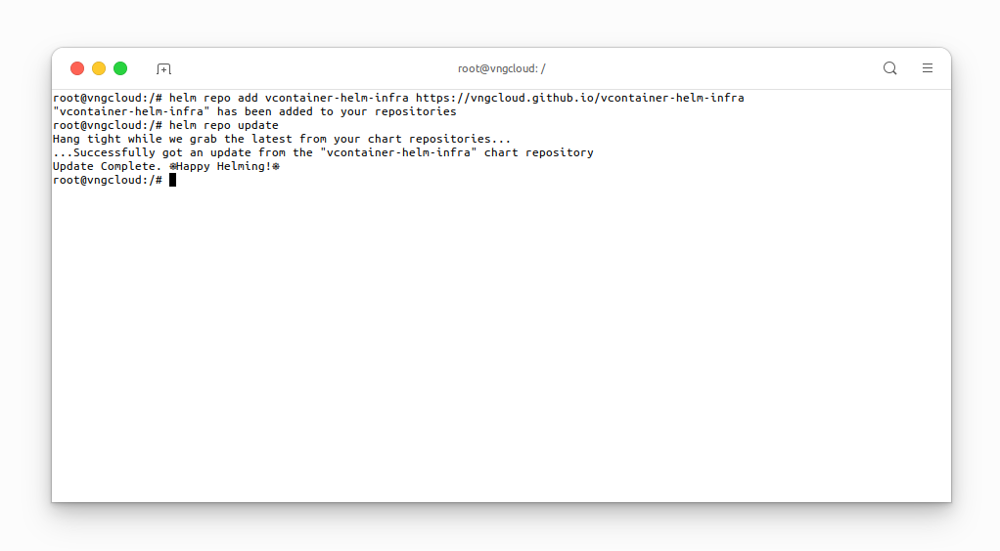
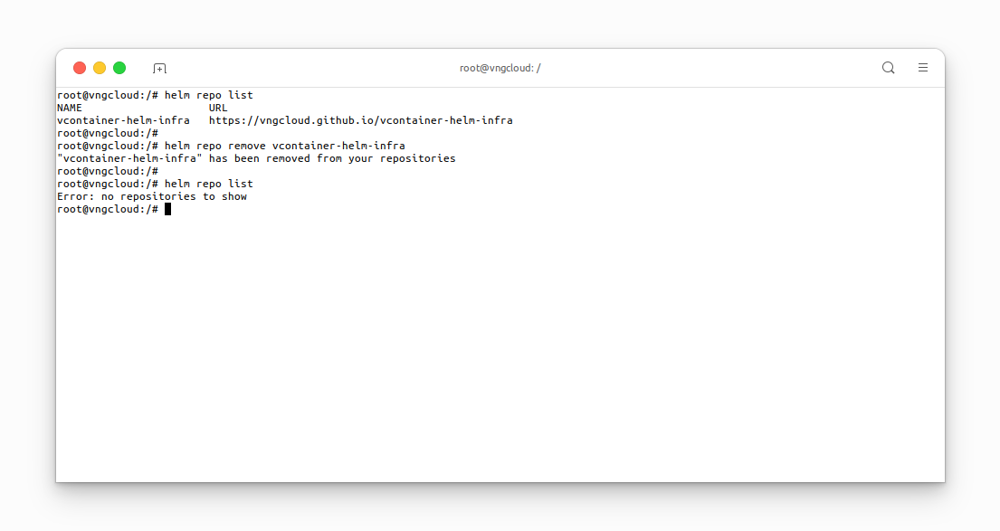

<center>

  

</center>


    


# Introduction

The **vContainer Helm Infra** repository houses **Helm Charts** designed to enhance functionalities for **vContainer Kubernetes clusters**.

These **Helm charts** seamlessly integrate with the infrastructure and services offered by **VNG CLOUD**. Through the **VNG CLOUD portal**, customers can efficiently oversee the resources of their vContainer Kubernetes clusters. The currently supported Helm charts include:

|#|Chart name|Description|Artifact/Github repository|
|-|-|-|-|
|1|[`vcontainer-storage-interface`](./helm-charts/vcontainer-storage-interface/index.md)|Provides `PersistentVolume` for **vContainer Kubernetes clusters**.|- **Artifact**: [https://artifacthub.io/packages/helm/vcontainer-helm-infra/vcontainer-storage-interface](https://artifacthub.io/packages/helm/vcontainer-helm-infra/vcontainer-storage-interface)<br>- **GitHub**: [https://github.com/vngcloud/vcontainer-storage-interface](https://github.com/vngcloud/vcontainer-storage-interface)|

# Installation
## Prerequisites
- Helm 3.0+, see [Installing Helm](https://helm.sh/docs/intro/install/).
- `kubeconfig` file of the **vContainer Kubernetes cluster**, see [Use Kubeclt to access the Container that was initialized at](https://docs.vngcloud.vn/display/VSERVERENG/Step+3%3A+Use+Kubeclt+to+access+the+Container+that+was+initialized+at).

## Install the `vcontainer-helm-infra` repository
To install the **vContainer Helm Infra** repository, use the following command:
  ```bash
  helm repo add vcontainer-helm-infra https://vngcloud.github.io/vcontainer-helm-infra
  helm repo update
  ```

<center>

  

</center>

# Uninstall the **vContainer Helm Infra** repository
- To completely remove the **vContainer Helm Infra** repository, use the following command:
```bash=
helm repo remove vcontainer-helm-infra
```

<center>

  

</center>
