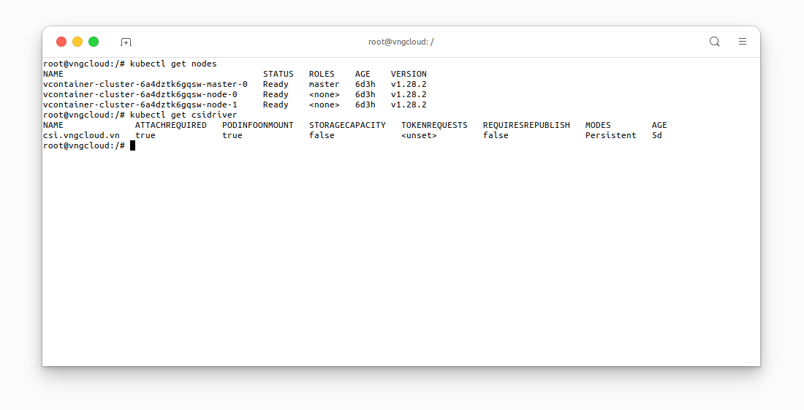

<div style="float: right;"></div><br>

# NFS server
## The block volume problem
- One drawback of **block volume** is that it **DOES NOT** support the `ReadWriteMany` (`RWX`) mode, this is understandable because Linux filesystem type `ext4` **DOES NOT** have multiple node writing permission.
- Therefore, to use `RWX` mode, the block volume must be replaced with a **shared file system** or **NFS server**.

\\( \Rightarrow \\) To solve the above problem, users can build a NFS server right inside the Kubernetes clusters, ensure high availability for it using Kubernetes Deployment, and allow services inside the cluster to access it via Kubernetes Service.

## Prepare the necessary resources
This laboratory exercise is conducted on a Kubernetes cluster comprising one master node and two worker nodes, all equipped with the **vContainer Storage Interface** plugin. The following resources are required:
```bash=
kubectl get nodes
kubectl get csidriver
```

<center>

  

</center>

## Deploy NFS server
As previously discussed, the `PersistentVolume` created by the **vContainer Storage Interface** plugin will be utilized. Subsequently, this volume will be mounted to the NFS server deployment, followed by the creation of the NFS server service. This enables other services to access the NFS server deployment through the NFS server service.

To do that, apply file nfs-server.yaml with the following content:
```yaml=
apiVersion: storage.k8s.io/v1
kind: StorageClass
metadata:
  name: nfs-server-sc                               # [1] The StorageClass name, CAN be changed
provisioner: csi.vngcloud.vn
parameters:
  type: vtype-2dd22a8b-179d-484c-bb91-b0520e218f80  # Change this value to proper Volume Type UUID
allowVolumeExpansion: true
---

apiVersion: v1
kind: PersistentVolumeClaim
metadata:
  name: nfs-server-pvc                              # [2] The PersistentVolumeClaim name, CAN be changed
spec:
  accessModes:
  - ReadWriteOnce
  resources:
    requests:
      storage: 100Gi                                # [3] The volume size, CAN be changed
  storageClassName: nfs-server-sc                   # MUST be same value with [1]
---

apiVersion: apps/v1
kind: Deployment
metadata:
  name: nfs-server                                  # [7] The Deployment name, CAN be changed
spec:
  replicas: 3                                       # [9] The number of replicas, this field is contrainted by the nodeSelector field below
  selector:
    matchLabels:
      app: nfs-server                               # MUST be same value with [6]
  template:
    metadata:
      labels:
        app: nfs-server                             # [6] The app label, CAN be changed
    spec:
      nodeSelector:
        kubernetes.io/hostname: <PUT_THE_HOSTNAME_OF_THE_PROPER_NODE>  # This field MUST be set if the replicas [9] greater than 1
      containers:
      - name: nfs-server
        image: registry.vngcloud.vn/public/volume-nfs:0.8
        ports:
        - name: nfs
          containerPort: 2049
        - name: mountd
          containerPort: 20048
        - name: rpcbind
          containerPort: 111
        securityContext:
          privileged: true
        volumeMounts:
          - mountPath: /exports                     # [5] The volume mount path, CAN be changed
            name: my-volume-name                    # MUST be same value with [4]
      volumes:
      - name: my-volume-name                        # [4] The volume mount name, CAN be changed
        persistentVolumeClaim:
          claimName: nfs-server-pvc                 # MUST be same value with [2]
          readOnly: false
---

apiVersion: v1
kind: Service
metadata:
  name: nfs-service                                 # [8] The Service name, CAN be changed
spec:
  ports:
  - name: nfs
    port: 2049
  - name: mountd
    port: 20048
  - name: rpcbind
    port: 111
  selector:
    app: nfs-server                                 # MUST be same value with [6]
```