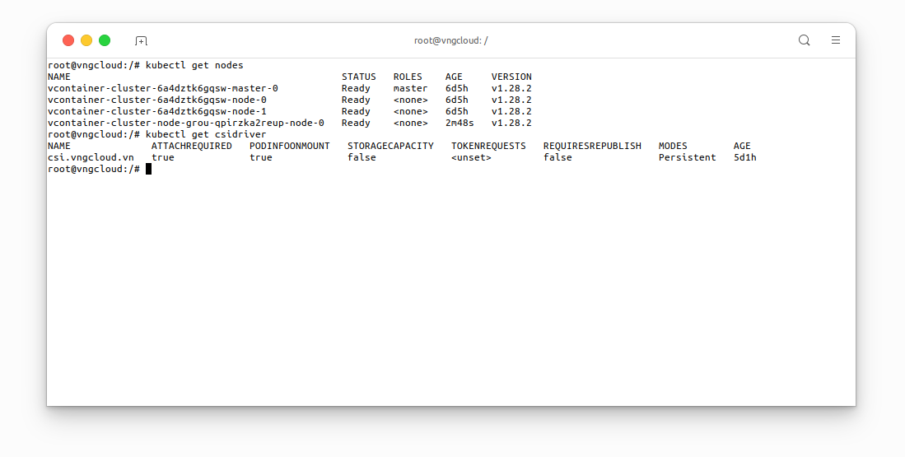
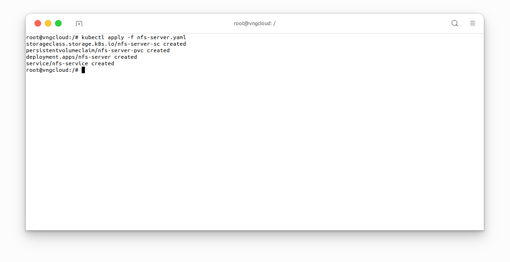
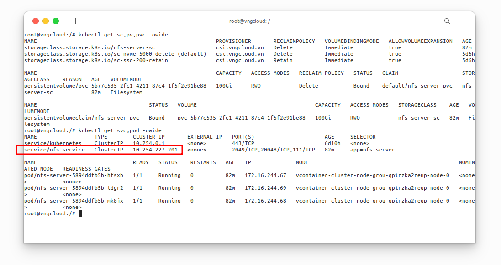
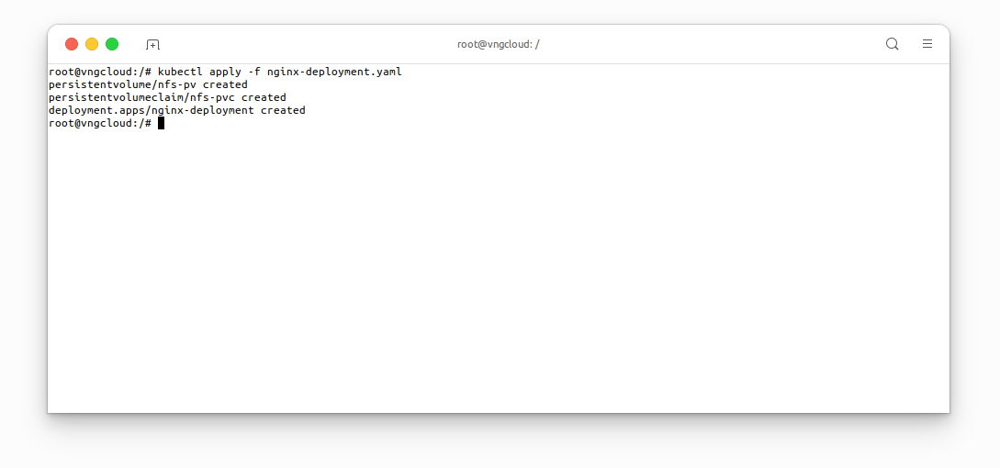
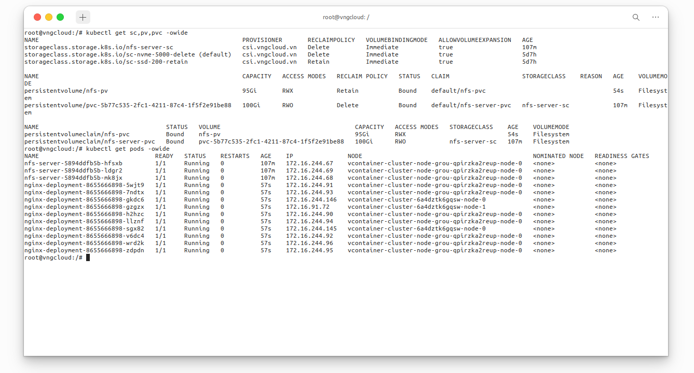

<div style="float: right;"></div><br>

# NFS server
## The block volume problem
- One drawback of **block volume** is that it **DOES NOT** support the `ReadWriteMany` (`RWX`) mode, this is understandable because Linux filesystem type `ext4` **DOES NOT** have multiple node writing permission.
- Therefore, to use `RWX` mode, the block volume must be replaced with a **shared file system** or **NFS server**.

\\( \Rightarrow \\)  To solve the above problem, users can build an NFS server inside the Kubernetes clusters, ensure high availability using Kubernetes Deployment, and allow services inside the cluster to access it via Kubernetes Service.

## Prepare the necessary resources
This laboratory exercise is conducted on a Kubernetes cluster comprising one master node and three worker nodes, all equipped with the **vContainer Storage Interface** plugin. The following resources are required:
```bash=
kubectl get nodes
kubectl get csidriver
```

<center>

  

</center>

## Deploy NFS server
As previously discussed, the `PersistentVolume` created by the **vContainer Storage Interface** plugin will be utilized. Subsequently, this volume will be mounted to the NFS server deployment, followed by the creation of the NFS server service. This enables other services to access the NFS server deployment through the NFS server service. In my scenario, I selected node `vcontainer-cluster-node-grou-qpirzka2reup-node-0` as the NFS server.

To do that, apply file [nfs-server.yaml](https://raw.githubusercontent.com/vngcloud/vcontainer-helm-infra-documentation/main/manifests/nfs-server/nfs-server.yaml) with the following content:
```yaml=
apiVersion: storage.k8s.io/v1
kind: StorageClass
metadata:
  name: nfs-server-sc                                                             # [1] The StorageClass name, CAN be changed
provisioner: csi.vngcloud.vn
parameters:
  type: vtype-2dd22a8b-179d-484c-bb91-b0520e218f80                                # Change this value to proper Volume Type UUID
allowVolumeExpansion: true
---

apiVersion: v1
kind: PersistentVolumeClaim
metadata:
  name: nfs-server-pvc                                                            # [2] The PersistentVolumeClaim name, CAN be changed
spec:
  accessModes:
  - ReadWriteOnce
  resources:
    requests:
      storage: 100Gi                                                              # [3] The volume size, CAN be changed
  storageClassName: nfs-server-sc                                                 # MUST be same value with [1]
---

apiVersion: apps/v1
kind: Deployment
metadata:
  name: nfs-server                                                                # [7] The Deployment name, CAN be changed
spec:
  replicas: 3                                                                     # [9] The number of replicas, this field is contrainted by the nodeSelector field below
  selector:
    matchLabels:
      app: nfs-server                                                             # MUST be same value with [6]
  template:
    metadata:
      labels:
        app: nfs-server                                                           # [6] The app label, CAN be changed
    spec:
      nodeSelector:
        kubernetes.io/hostname: vcontainer-cluster-node-grou-qpirzka2reup-node-0  # IMPORTANT: This field MUST be set if the replicas [9] greater than 1
      containers:
      - name: nfs-server
        image: registry.vngcloud.vn/public/volume-nfs:0.8
        ports:
        - name: nfs
          containerPort: 2049
        - name: mountd
          containerPort: 20048
        - name: rpcbind
          containerPort: 111
        securityContext:
          privileged: true
        volumeMounts:
          - mountPath: /exports                                                   # [5] The volume mount path, CAN be changed
            name: my-volume-name                                                  # MUST be same value with [4]
      volumes:
      - name: my-volume-name                                                      # [4] The volume mount name, CAN be changed
        persistentVolumeClaim:
          claimName: nfs-server-pvc                                               # MUST be same value with [2]
          readOnly: false
---

apiVersion: v1
kind: Service
metadata:
  name: nfs-service                                                               # [8] The Service name, CAN be changed
spec:
  ports:
  - name: nfs
    port: 2049
  - name: mountd
    port: 20048
  - name: rpcbind
    port: 111
  selector:
    app: nfs-server                                                               # MUST be same value with [6]
```

Apply the above manifest:
```bash=
kubectl apply -f nfs-server.yaml
```

<center>

  

</center>

Verify the resources have been created
```bash=
kubectl get sc,pv,pvc -owide
kubectl get svc,pod -owide
```

<center>

  

</center>

At this moment, you **SHOULD** take note the `CLUSTER IP` of `nfs-service` service, in my case, it is `10.254.227.201`, this IPv4 address will be used later.

## Deploy a service to use the NFS server
Now, I will create `PersistentVolume`, `PersistentVolumeClaim` and `nginx` Deployment, follwing the content of file nginx-deployment.yaml, you **MUST** use the IPv4 address of the `nfs-service` service which I mentioned in the previous section:

***File [nginx-deployment.yaml](https://raw.githubusercontent.com/vngcloud/vcontainer-helm-infra-documentation/main/manifests/nfs-server/nginx-deployment.yaml)***
```yaml=

apiVersion: v1
kind: PersistentVolume
metadata:
  name: nfs-pv                                        # [1] The PersistentVolume name, CAN be changed
  labels:
    app: nfs-data                                     # [2] The app label, CAN be changed
spec:
  capacity:
    storage: 95Gi                                     # The volume size, MUST less than or equal to the size of the PVC that was mounted to the NFS server
  accessModes:
    - ReadWriteMany                                   # MUST be ReadWriteMany
  nfs:
    server: "10.254.227.201"                          # IMPORTANT: Change this value to proper IPv4 address
    path: "/"
---

apiVersion: v1
kind: PersistentVolumeClaim
metadata:
  name: nfs-pvc                                       # [3] The PersistentVolumeClaim name, CAN be changed
spec:
  accessModes:
    - ReadWriteMany                                   # MUST be ReadWriteMany
  storageClassName: ""                                # MUST be empty
  resources:
    requests:
      storage: 10Gi                                   # The volume size, MUST less than or equal to the size of the volume size of [1]
  selector:
    matchLabels:
      app: nfs-data                                   # MUST be same value with [2]
---

apiVersion: apps/v1
kind: Deployment
metadata:
  name: nginx-deployment                              # [4] The Deployment name, CAN be changed
  labels:
    app: nginx                                        # [6] The app label, CAN be changed
spec:
  replicas: 10                                        # [5] The number of replicas, CAN be changed
  selector:
    matchLabels:
      app: nginx                                      # MUST be same value with [6]
  template:
    metadata:
      labels:
        app: nginx                                    # MUST be same value with [6]
    spec:
      containers:
      - name: nginx
        image: nginx
        ports:
        - containerPort: 80
        volumeMounts:
          - mountPath: /var/lib/www/html              # The mount path in container, CAN be changed
            name: my-volume-name                      # MUST be same value with [7]
      volumes:
      - name: my-volume-name                          # [7] The volume mount name, CAN be changed
        persistentVolumeClaim:
          claimName: nfs-pvc                          # MUST be same value with [3]
          readOnly: false
```

Apply the above manifest:
```bash=
kubectl apply -f nginx-deployment.yaml
```

<center>

  

</center>

Verify the resources have been created:

```bash=
kubectl get sc,pv,pvc -owide
kubectl get pods -owide
```

<center>

  

</center>


## Resize the NFS server volume
User can follow the steps in the [Volume resizing](./volume-resizing.md) section to resize the NFS server volume.