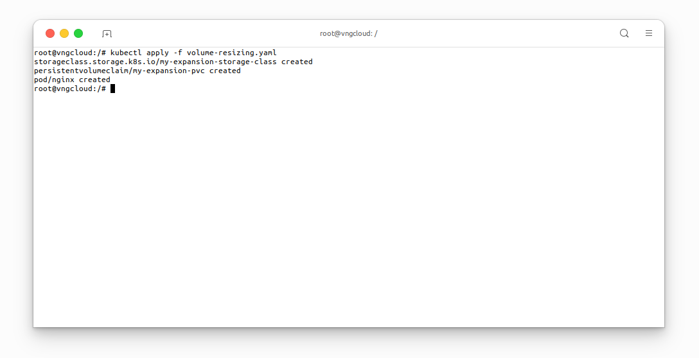
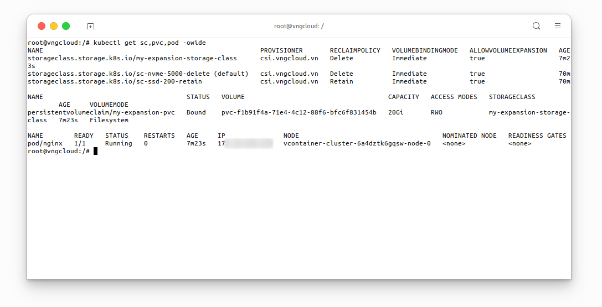
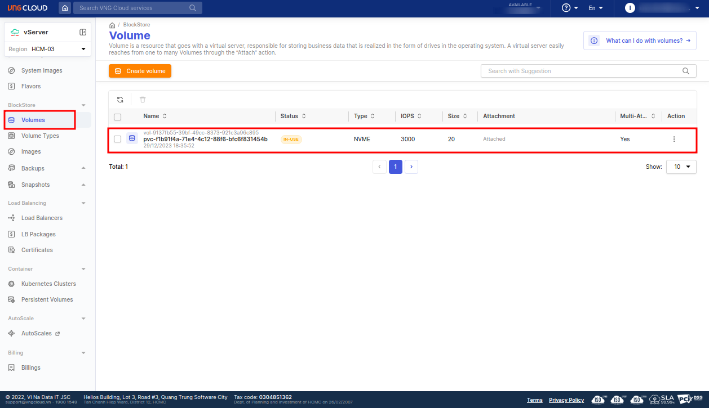
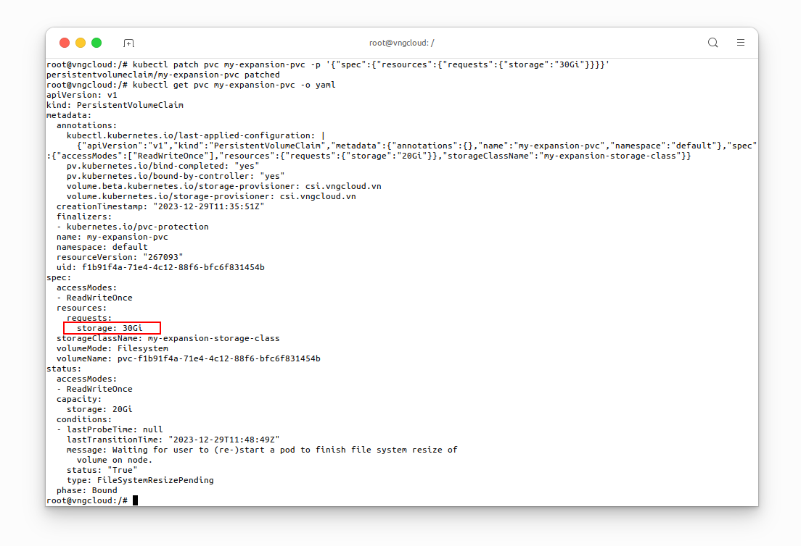
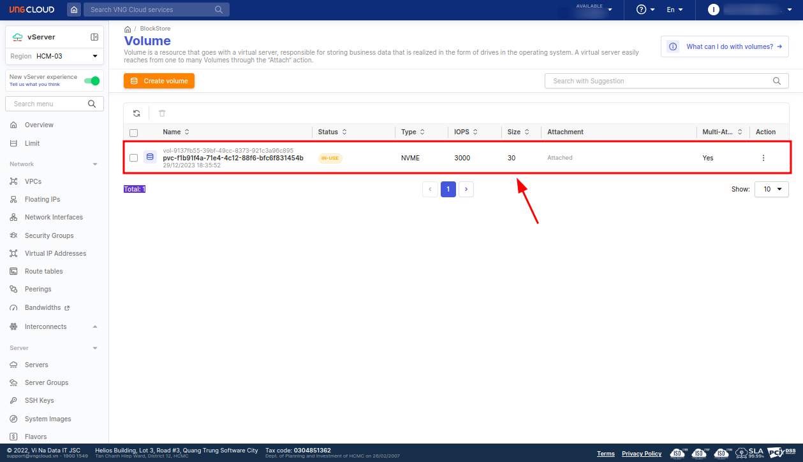
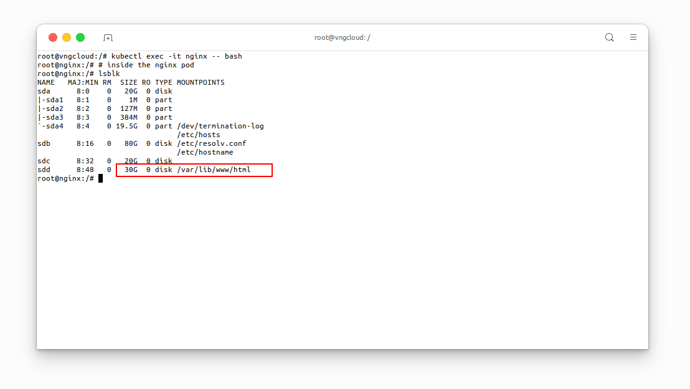

<div style="float: right;"></div><br>


# Volume resizing
## Prepare the resources
Utilize the [volume-resizing.yaml](https://raw.githubusercontent.com/vngcloud/vcontainer-helm-infra-documentation/main/manifests/resizing/resizing.yaml) file to provision the required resources prior to resizing the `PersistentVolumeClaim`.

  > ⚠️ **IMPORTANT**:
  > To enable Volume Expansion, it is **IMPERATIVE** to set the `allowVolumeExpansion` option to `true` in the `StorageClass` manifest file.

***File [volume-resizing.yaml](https://raw.githubusercontent.com/vngcloud/vcontainer-helm-infra-documentation/main/manifests/resizing/resizing.yaml)***
```yaml=
apiVersion: storage.k8s.io/v1
kind: StorageClass
metadata:
  name: my-expansion-storage-class                 # [1] The StorageClass name, CAN be changed
provisioner: csi.vngcloud.vn                       # The VNG-CLOUD CSI driver name
parameters:
  type: vtype-93a22a9f-1ec0-4e61-84fb-75ac181c13dc # The volume type UUID
allowVolumeExpansion: true                         # MUST set this value to turn on volume expansion feature
---

apiVersion: v1
kind: PersistentVolumeClaim
metadata:
  name: my-expansion-pvc                           # [2] The PVC name, CAN be changed
spec:
  accessModes:
    - ReadWriteOnce
  resources:
    requests:
      storage: 20Gi                                # [3] The PVC size, CAN be changed, this value MUST be in the valid range of the proper volume type
  storageClassName: my-expansion-storage-class     # [4] The StorageClass name, MUST be the same as [1]
---

apiVersion: v1
kind: Pod
metadata:
  name: nginx                                      # [5] The Pod name, CAN be changed
spec:
  containers:
    - image: nginx
      imagePullPolicy: IfNotPresent
      name: nginx
      ports:
        - containerPort: 80
          protocol: TCP
      volumeMounts:
        - mountPath: /var/lib/www/html
          name: my-volume-name                     # MUST be the same as [6]
  volumes:
    - name: my-volume-name                         # [6] The volume name, CAN be changed
      persistentVolumeClaim:
        claimName: my-expansion-pvc                # MUST be the same as [2]
        readOnly: false
```

Apply the manifest:
```bash=
kubectl apply -f volume-resizing.yaml
```

<center>

  

</center>

Wait a few seconds for the associated resources to be created:


```bash=
kubectl get sc,pvc,pod -owide
```

<center>

  

</center>

From the **VNG CLOUD portal**, users can verify the status of the `PersistentVolumeClaim`:

<center>

  

</center>


## Resize the Volume
Execute the following command to expand the `PersistentVolumeClaim` `my-expansion-pvc` from \\( \text{20Gi} \\) to \\( \text{30Gi} \\).

```bash=
kubectl patch pvc my-expansion-pvc -p '{"spec":{"resources":{"requests":{"storage":"30Gi"}}}}'
kubectl get pvc my-expansion-pvc -o yaml  # Verify the PVC size
```

<center>

  

</center>

From the **VNG CLOUD portal**, users can verify the new size of the `PersistentVolumeClaim`:

<center>

  

</center>

Let's exec into the `nginx` `Pod` and verify the new size of the volume:

```bash=
kubectl exec -it nginx -- bash

# inside the nginx pod
lsblk
```

<center>

  

</center>