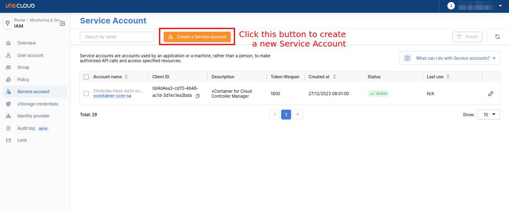
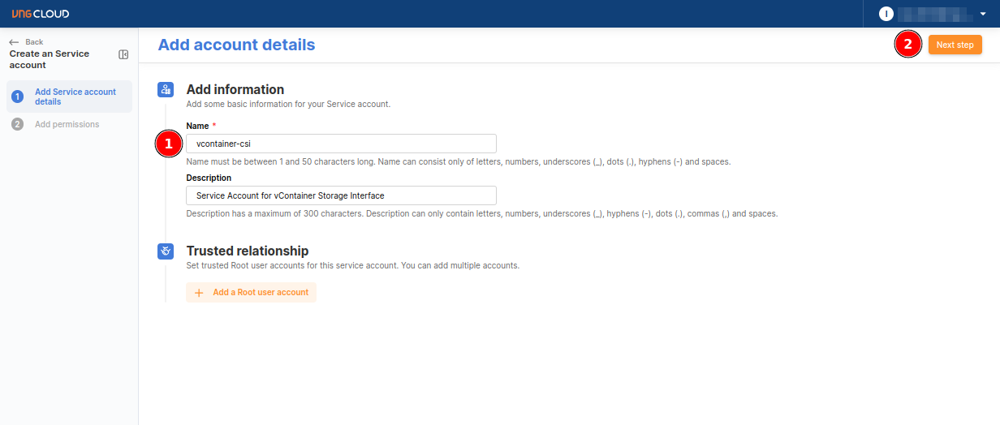
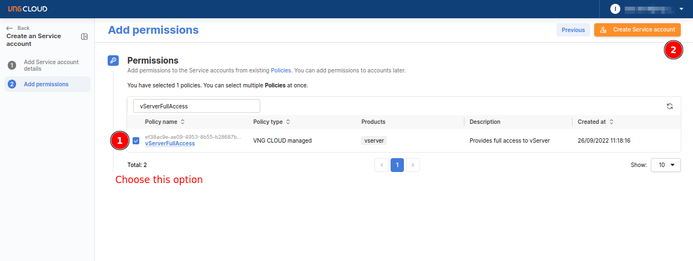
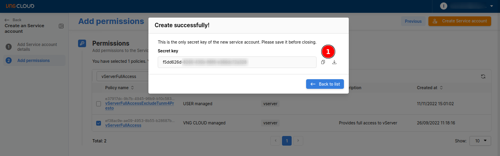
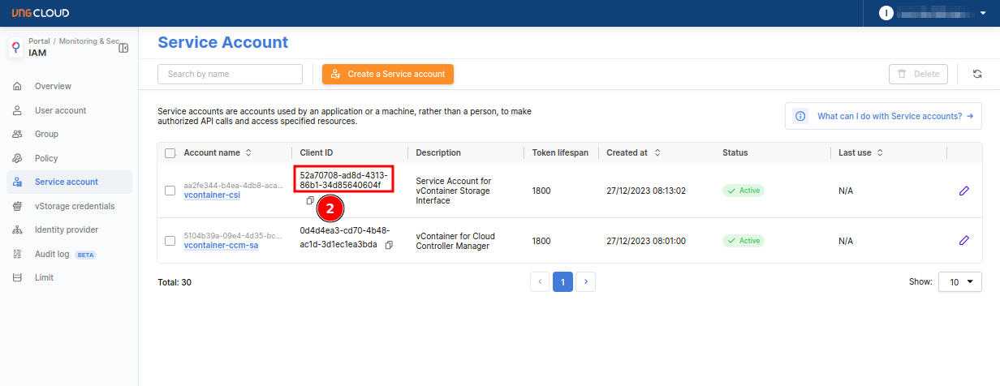
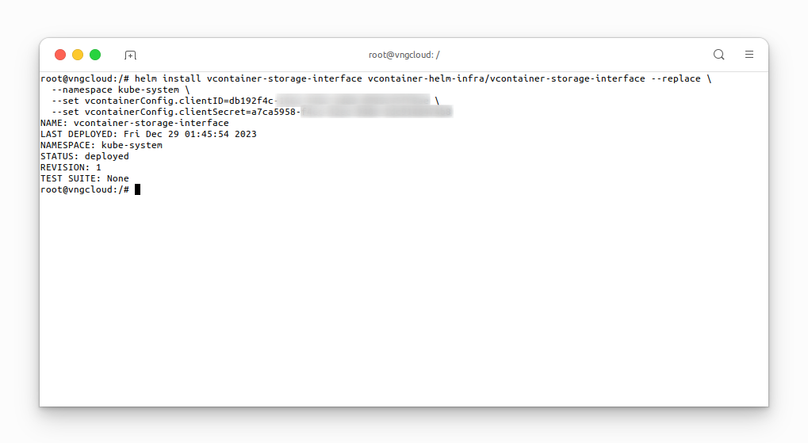
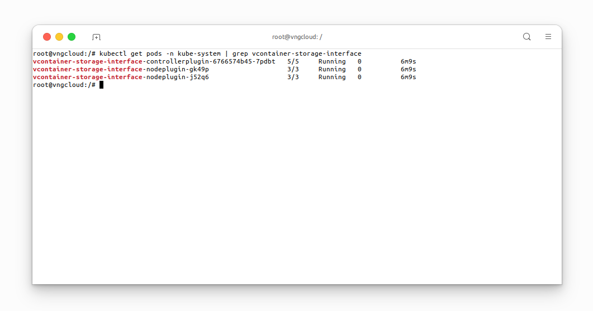
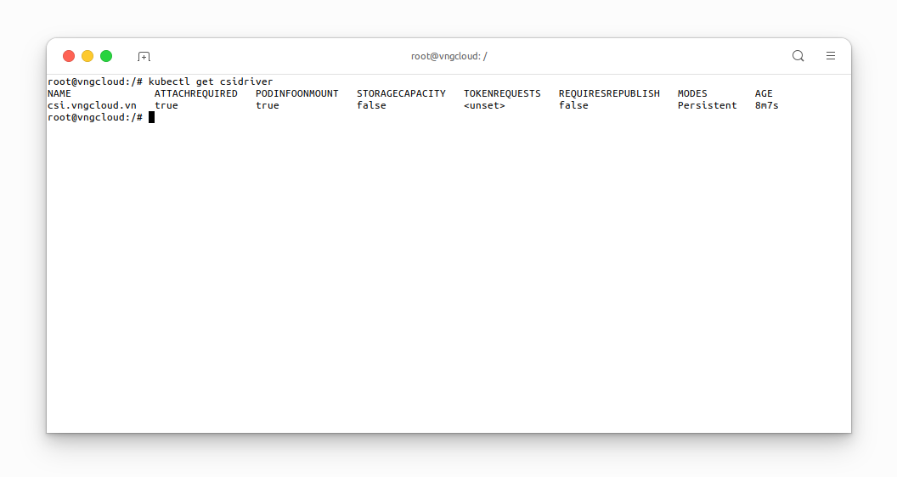
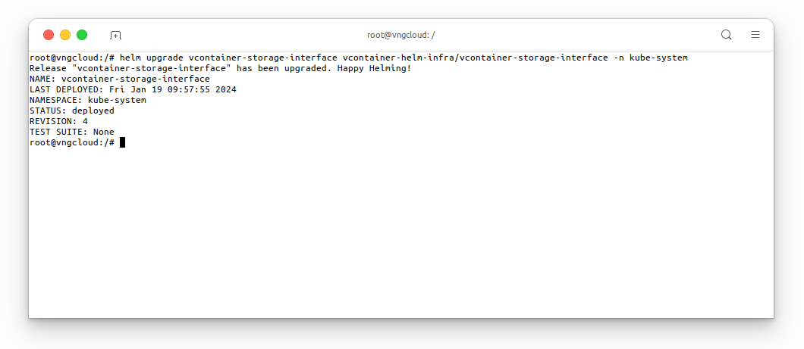
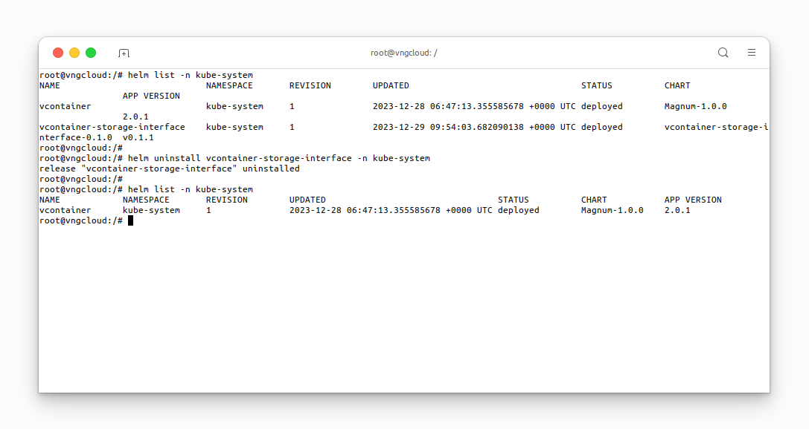

<div style="float: right;"></div><br>


# Installation
## Prepare the Service Account key pair
The **vContainer Storage Interface** plugin necessitates a **Service Account** for executing operations on volume resources. Users can establish a **Service Account** by accessing [the IAM dashboard](https://hcm-3.console.vngcloud.vn/iam/service-accounts). Follow the steps below to create a **Service Account**:
- **Step 1**: Access [the IAM dashboard](https://hcm-3.console.vngcloud.vn/iam/service-accounts) to create a new **Service Account**:<br>

<center>

  

</center>

- **Step 2**: Assign a name to **Service Account** and proceed by clicking **Next step**:<br>

<center>

  

</center>

- **Step 3**: Grant `vServerFullAccess` permission to **Service Account** and then click **Create Service account**:<br>

<center>

  

</center>

- **Step 4**: Save the **Secret key** and **Client ID** of the newly created **Service Account**:
  - Copy the **Secret key**:<br>
  <center>

    
  
  </center>
  
  - Copy the **Client ID**:<br>

  <center>

    

  </center>

## Install the `vcontainer-storage-interface` chart
Before installing `vcontainer-storage-interface` chart, users **MUST** add `vcontainer-helm-infra` repository to their local Helm repository list, as detailed in the [Install the vcontainer-helm-infra repository](./../../index.md#install-the-vcontainer-helm-infra-repository) section, and prepare the **Service Account** key pair following the instructions in the previous section. Subsequently, execute the following command to initiate the chart installation:
```bash=
helm install vcontainer-storage-interface vcontainer-helm-infra/vcontainer-storage-interface --replace \
  --namespace kube-system \
  --set vcontainerConfig.clientID=<PUT_YOUR_CLIENT_ID> \
  --set vcontainerConfig.clientSecret=<PUT_YOUR_SECRET_KEY>
```

<center>

  

</center>

## Verify the installation
After the installation is complete, execute the following command to verify the status of the `vcontainer-storage-interface` pods:
```bash=
kubectl get pods -n kube-system | grep vcontainer-storage-interface
```

<center>

  

</center>

About the **vContainer Storage Interface** plugin, user can get the information of the plugin by executing the following command:
```bash=
kubectl get csidriver
```

<center>

  

</center>

# Upgrade the `vcontainer-storage-interface` chart to latest version
If you followed the instructions in the [Install the vcontainer-storage-interface chart](#install-the-vcontainer-storage-interface-chart) section to install the `vcontainer-storage-interface` chart, execute the following command to upgrade the chart:
```bash=
helm upgrade vcontainer-storage-interface vcontainer-helm-infra/vcontainer-storage-interface -n kube-system
```

<center>

  

</center>


# Uninstallation
If you followed the instructions in the [Install the vcontainer-storage-interface chart](#install-the-vcontainer-storage-interface-chart) section to install the `vcontainer-storage-interface` chart, execute the following command to uninstall the chart:
```bash=
helm uninstall vcontainer-storage-interface -n kube-system
```

<center>

  

</center>